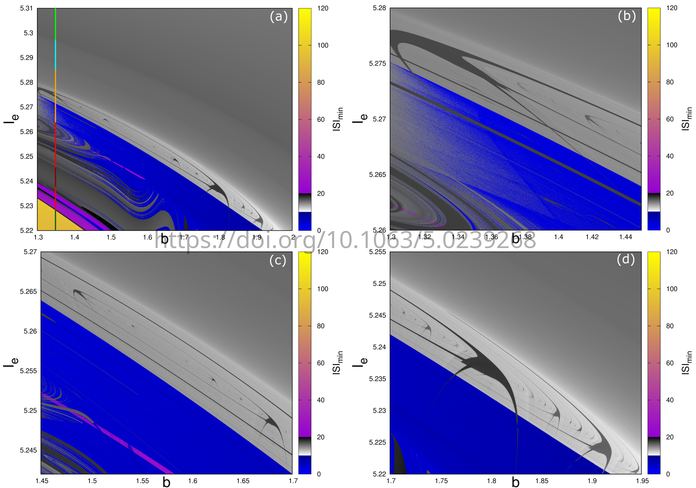

# ISI phase diagrams of HR model
As shown in the article "Shrimp hubs in the Hindmarsh-Rose model" (https://doi.org/10.1063/5.0239268), co-autored by Rafael V. Stenzinger, Vinícius L. Oliveira and Marcelo H. R. Tragtenberg, the HR model presents shrimp-like periodic structures in its phase diagram. The code presented in this repository was used to produce the results in this article, and can be modified to generate plots such as the ones in Figures 4, 6, 7 and 8 (just modify the numbers for $b$, $I_e$ and their step number in hr_code.c to better fit your needs). 

The code is written in C, implementing a 4th order Runge-Kutta method to solve the HR equations:

$$
\dot{x} = y - a x^3 + b x^2 - z + I
$$
$$
\dot{y} = c - d x^2 - y
$$
$$
\dot{z} = r [s (x - x_r) - z]. \\
$$

The interspike interval (ISI) phase diagrams are produced by taking steps in $(b, I_e)$ parameter space and analyzing the ISI of the time series after discarding the transient. The minimum and maximum values of ISI for a point in the parameter space is registered and used as a color map. 

## Code implementation details
- The code is written in C and uses OpenMP to multithread, and run different lines of the phase diagram in parallel. Use -fopenmp flag when compiling and **adapt thread number to your system by modifying** hr_code.c
- In order to reduce fprintf calls, and better save runtime, buffer sizes were set so that the data file is written "in batches". Change this to your preference.
- Bash script build_diagram.sh compiles, runs the C file with a certain time discretization and plots the phase diagram. In order to change time interval and number of iterations, change in this bash script.
- Plot details in GNUPLOT file. The script is such that it will generate Figure 4D picture:

<p align="center">
  
</p>

- In order to compile, either run build_diagram.sh or use:
```
gcc hr_code.c -march=native -O2 -lm -o HR -fopenmp
```
### Final disclaimer
If you use this repositoty, please cite:

@article{10.1063/5.0239268,
    author = {Stenzinger, Rafael V. and Luz Oliveira, Vinícius and Tragtenberg, M. H. R.},
    title = {Shrimp hubs in the Hindmarsh–Rose model},
    journal = {Chaos: An Interdisciplinary Journal of Nonlinear Science},
    volume = {35},
    number = {2},
    pages = {023148},
    year = {2025},
    month = {02},
    issn = {1054-1500},
    doi = {10.1063/5.0239268},
    url = {https://doi.org/10.1063/5.0239268},
    eprint = {https://pubs.aip.org/aip/cha/article-pdf/doi/10.1063/5.0239268/20400868/023148_1_5.0239268.pdf},
}


